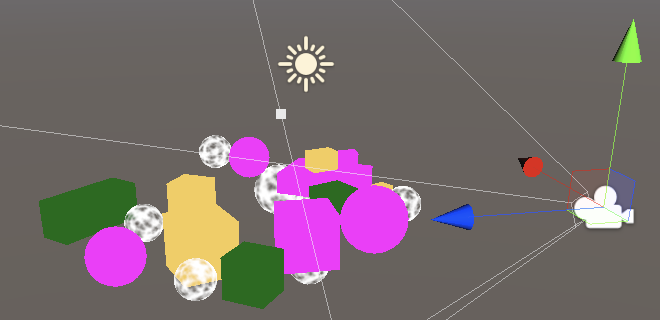
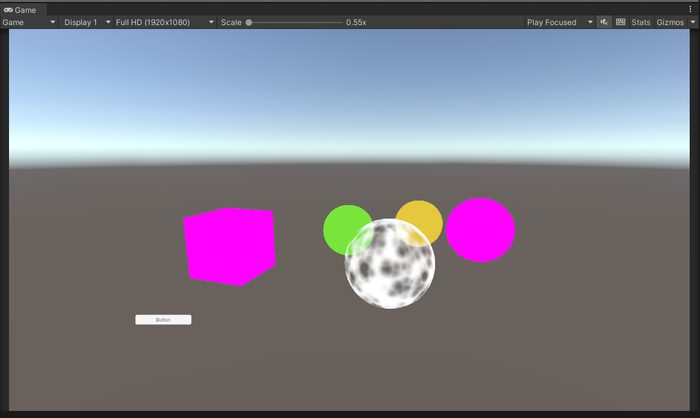
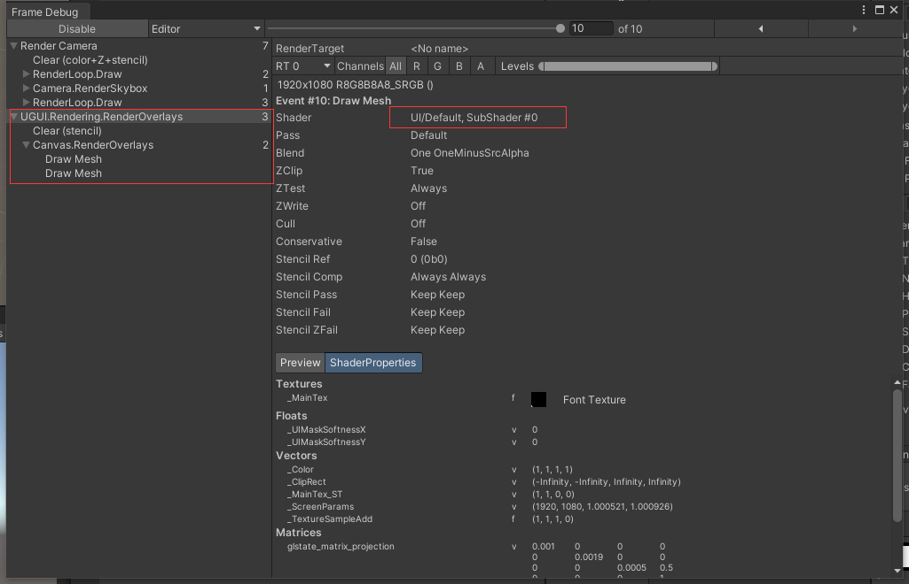
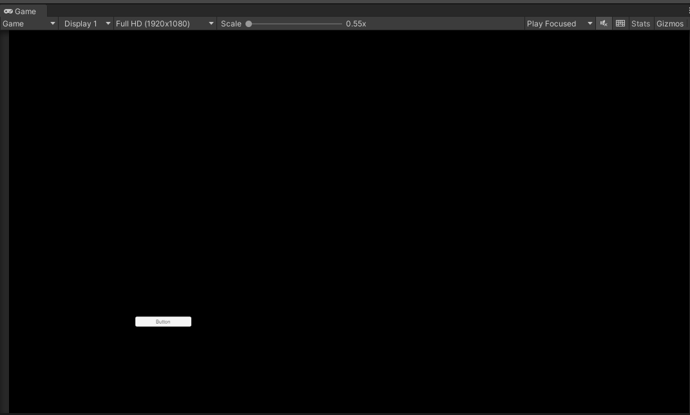
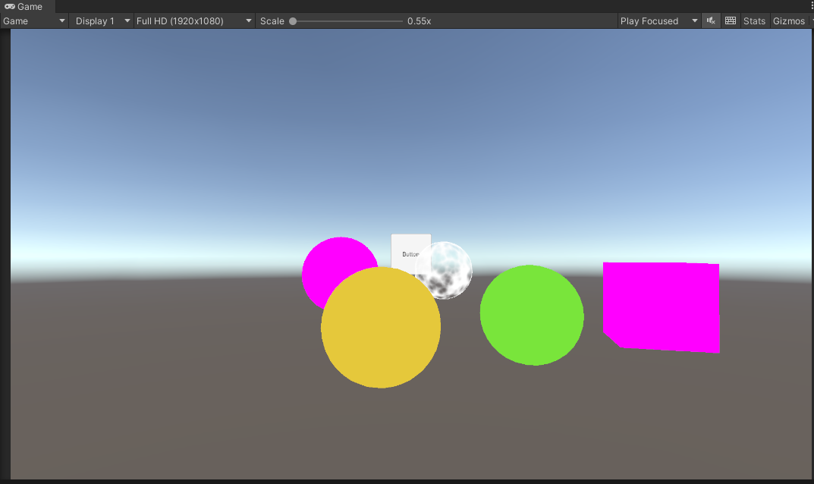

# 【Catlike Coding Custom SRP学习之旅——1】Custom Render Pipeline
#### 写在前面
我是一个计算机图形学领域的新手，虽然在游戏公司实习了有一段时间，但我对图形学的认知仍然十分肤浅，我目前看过Games 101，最近也把冯乐乐的《Shader入门精要》看完了，因此我的图形学知识只会小于等于这两者（忘了好多55），接下来我打算学习下SRP，参考其他大佬们的文章，并记录下自己的随笔，也算是给自己挖个坑吧（之前其实自己跟着Catlike做过前几章，但后来半途而废了），希望自己能填完这个坑。因为我的知识有限同时又喜欢无知地乱写，如果随笔中有错误，欢迎批评指正。


以下是原教程链接与我的Github工程：

[CatlikeCoding-SRP-Tutorial](https://catlikecoding.com/unity/tutorials/custom-srp/)

[我的Github工程](https://github.com/recaeee/CatlikeCoding-Custom-RP)

我使用的Unity版本为2021.3.11f1c2(教程中使用的为2019.2.6f1，希望之后不会给自己挖坑)，初始项目为Built-in的模板工程。废话了这么多，进入正题吧。


---

#### 自定义渲染管线 Custom Render Pipeline
在谈自定义渲染管线前，先唠唠**渲染管线**吧。

其实到现在为止，我仍然对渲染管线的概念模糊不清，在我的理解里，渲染管线是一个将一个数字几何世界呈现到屏幕上的抽象流程。而其对应的具体流程就是冯乐乐书中最开头讲的渲染流水线,即“计算机需要从一系列的顶点数据、纹理等信息出发，把这些信息最终转换成一张人眼可以看到的图像”。

而从接触图形学开始，我就对渲染管线的具体流程的理解十分粗暴，顶点数据首先进入顶点着色器进行MVP变换转换到摄像机空间，然后光栅化，每个片段进入片段着色器，设置每个片段的颜色，最后把像素呈现到屏幕上。（总感觉少了些很多东西呢）

<div align=center>


</div>

在我的理解里，整个渲染的流程就如上图所示，通过openGL简单编写上述流程，最后我们很容易就能获得一幅无趣的图像。但在游戏中，我们需要实现光照、阴影等效果，而阴影贴图的渲染并不在上述这些阶段中（虽然说其实阴影贴图的渲染走的也是上面这一套流程，只是不是输出到屏幕图像上），那我们怎么样把阴影的实现加进去呢？而同时基于各种需求又会有前向渲染和延迟渲染，我们在哪一步生成阴影贴图，怎么样把各种效果，比如UI、透明物体叠加在原本无趣的图像上，渲染管线似乎就无法简单地像上述图片上所描述的那样了。

上述只是我对渲染管线的一定理解吧，其实参考[这个知乎问题的回答](https://www.zhihu.com/question/379346645/answer/1079363174)，可能会理解得更透彻一些，总结来说，上图中的”渲染管线”是指**GPU硬件层面的渲染管线**，而“自定义渲染管线”中的“渲染管线”是**应用层面的高级渲染管线，是需要通过api调用来搭建的管线**。

参考[丛越大佬对渲染管线的描述](https://zhuanlan.zhihu.com/p/70668533)，**渲染管线是游戏引擎完成一帧画面的高层渲染逻辑和流程**，而一些引擎中传统的前向和延迟渲染管线往往只开放了管线中一些顶点着色器、片元着色器的可编辑性，而这些局限的编辑肯定无法满足如今游戏开发者们对画面、性能的追求，比如NPR等风格化渲染，用那一套传统的管线去实现那些与众不同的效果就好比想尽办法拿两辆自行车拼一起组装成跑车，吃力也不一定能达到效果。换句话说，都什么年代了，都还在用传统管线。

我在网上也找到了一些对于为什么要选择使用自定义渲染管线而不是传统渲染管线的[讨论](https://www.zhihu.com/question/379857981)，总而言之，学习自定义渲染管线不仅能让自己更自由地去做开发，同时也能让自己对渲染管线的认识更进一步。

从Unity 2018开始，Unity就引入了自定义渲染管线，它实现了让我们在渲染流程中做任何事情，并且提供给了我们传统渲染管线中的那些工具，比如裁剪。这也就意味着像裁剪、设置相机属性、支持光源等传统渲染管线中必不可少的一些工作不需要我们自己编写，直接调用Unity封装好的函数就行了。这想想都让人兴奋吧，就好比我想自己创作一幅画，但基本所有我要用的画笔、工具、颜料都有人帮我准备好了，我只要管往画布上乱涂乱画就行了。在我的理解中，自定义渲染管线就是这样的一个东西：**我可以自定义渲染管线中的任何流程，并且已经给我准备好了基础的工具，不需要像编写OpenGL一样自己编写所有的操作**。

好了好了，你已经大致了解什么是渲染管线了，接下来就由你自己编写一套高质量渲染管线吧！:)（开始变成无情的翻译机器人）

（我只会对其中重要的部分进行翻译和解释，其他则会简单带过，否则量太多了）

---
#### 1.1 新建工程 Project Setup

<div align=center>

](https://raw.githubusercontent.com/recaeee/PicGo/main/!%5B%5D(2022-12-01-23-53-11.png).png)

</div>

进入项目第一步，进入PackageManager把除了*Unity UI*之外的Package全删了（保持项目中不存在没用到的Package和代码块是良好的习惯，当然我还保留了IDE的Package），然后把颜色空间从Gamma空间设置成线性空间（不要问我怎么设置，看原教程吧~）。

下一步，在场景中摆一些standard、unlit和transparent材质的物体。

<div align=center>

](https://raw.githubusercontent.com/recaeee/PicGo/main/!%5B%5D(2022-12-04-23-59-36.png).png)

</div>

#### 1.2 管线资源 Pipeline Asset

此时，Unity使用的Render Pipeline是默认的也就是Builtin的内置渲染管线，从Project Setting窗口中也可以看出。
<div align=center>

](https://raw.githubusercontent.com/recaeee/PicGo/main/!%5B%5D(2022-12-05-00-05-19.png).png)

</div>

因此，为了使用自定义渲染管线，我们要做的第一件是创建一个**自定义**的Render Pipeline Asset，*Render Pipeline Asset*是Unity已经定义好的一种Asset类型，既然要使用自定义的Asset，所以我们需要自己定义一个Asset类，让它继承自*RenderPipelineAsset*，这个自定义的类我们就叫它**CustomRenderPipelineAsset**，这里首先要明确的一点是，它是一个类型，我们要通过这个类型创建它的Asset实例来当作我们的Render Pipeline Asset。

现在一定会有人好奇这个Render Pipeline Asset是用来干啥的吧，其实Render Pipeline Asset的作用就是**定义**（注意，不是确定实际数值）了一些实际渲染时的参数，比如阴影质量、光照质量等。

那实际**确定**这些数值是多少的是谁呢？是**RenderPipeline**（这也就是为什么RenderPipelineAsset里会有一个函数叫CreatePipeline，同时这就意味着RenderPipeline的创建是基于RenderPipelineAsset的），RenderPipeline确定了实际游戏运行时我们的阴影质量是高是低这些。那为什么Unity要搞得这么复杂呢，我定义了一个Asset，结果这个Asset还只是定义了一些定义，然后最后应用的实例是RenderPipeline，哇这也太麻烦了。Unity这样做是有它的道理的，因为在实际游戏中，我们不可能只使用一套实际的参数，那就涉及到了我们会创建多个实际的RenderPipeline应用于不同质量的渲染上，其实很好理解吧，不同性能的设备上用的RenderPipeline肯定不同，不可能在一台低端机上跑很高质量的渲染，同时一台设备上，我可能也需要实时去切换渲染的质量。

写好RenderPipelineAsset的定义，CreatePipeline返回null之后，创建一个CustomRenderPipelineAsset,然后使用它，好，画面变黑啦~

```c#
using UnityEngine;
using UnityEngine.Rendering;

[CreateAssetMenu(menuName = "Rendering/Custom Render Pipeline")]
public class CustomRenderPipelineAsset : RenderPipelineAsset
{
    //重写创建实际RenderPipeline的函数
    protected override RenderPipeline CreatePipeline()
    {
        //暂时返回null
        return null;
    }
}
```

#### 1.3 渲染管线实例 Render Pipeline Instance

在创建好CustomRenderPipelineAsset之后，因为我们在CreatePipeline函数中返回了null，因此当我们创建RenderPipeline的实例的时候会返回null，并没有实际的RenderPipeline产生，所以必然导致了我们的画面是全黑。所以，下一步，我们的目的是让CreatePipeline函数返回正确的RenderPipeline，那我们想返回的RenderPipeline必然是我们自定义的RenderPipeline，因此我们需要定义CustomRenderPipeline，它继承自RenderPipeline，同时我们必须重写其中的Render函数。

```c#
using UnityEngine;
using UnityEngine.Rendering;

public class CustomRenderPipeline : RenderPipeline
{
    //必须重写Render函数，目前函数内部什么都不执行
    protected override void Render(ScriptableRenderContext context, Camera[] cameras)
    {
        
    }
}
```

(CustomRenderPipelineAsset那边的修改就不贴上来了，在这里只贴上我认为关键的部分)

#### 2 渲染 Rendering

在RenderPipeline的实例中，Unity每一帧都会执行其Render函数，该函数传入了一个ScriptableRenderContext类型的context用于连接引擎底层，我们用它来实际进行渲染，粗暴来说，每帧内所有渲染相关的信息都存放在context中，同时该函数传入一个摄像机数组，很好理解，意思是我们要在当前帧按顺序渲染这些摄像机拍到的画面。

#### 2.1 摄像机渲染器 Camera Renderer

我们希望每一个摄像机都会以各自的方式去渲染。所以我们不会使用CustomRenderPipeline渲染所有的摄像机，而是定义一个CameraRenderer类用于管理所有摄像机的渲染。

```c#
using UnityEngine;
using UnityEngine.Rendering;

public class CameraRenderer
{
    //存放当前渲染上下文
    private ScriptableRenderContext context;

    //存放摄像机渲染器当前应该渲染的摄像机
    private Camera camera;

    //摄像机渲染器的渲染函数，在当前渲染上下文的基础上渲染当前摄像机
    public void Render(ScriptableRenderContext context, Camera camera)
    {
        this.context = context;
        this.camera = camera;
    }
}
```

虽然前面说了希望每个摄像机以各自的方式渲染，但目前看来我们所有摄像机都是以相同的方式渲染(调用CameraRenderer.Render函数)，但是你先别急。

#### 2.2 绘制天空盒 Drawing the Skybox

虽然这一步的标题是“绘制天空盒”，但我们更需要注意的一点是，我们渲染的流程是**将一系列渲染相关的指令缓存到上下文中，再进行提交，以此按顺序执行缓存的指令队列**。（但在后续的文章中，我可能不会说“向context注入XXXX绘制指令”，而是直接说绘制XXXX，但是这样的思想需要熟记）

```c#
using UnityEngine;
using UnityEngine.Rendering;

public class CameraRenderer
{
    //存放当前渲染上下文
    private ScriptableRenderContext context;

    //存放摄像机渲染器当前应该渲染的摄像机
    private Camera camera;

    //摄像机渲染器的渲染函数，在当前渲染上下文的基础上渲染当前摄像机
    public void Render(ScriptableRenderContext context, Camera camera)
    {
        //设定当前上下文和摄像机
        this.context = context;
        this.camera = camera;
        
        DrawVisibleGeometry();
        Submit();
    }
    
    void DrawVisibleGeometry()
    {
        //添加“绘制天空盒”指令，DrawSkybox为ScriptableRenderContext下已有函数，这里就体现了为什么说Unity已经帮我们封装好了很多我们要用到的函数，SPR的画笔~
        context.DrawSkybox(camera);
    }

    void Submit()
    {
        //提交当前上下文中缓存的指令队列，执行指令队列
        context.Submit();
    }
}
```

完成了这步，Scene和Game视窗内出现了天空盒，从FrameDebugger中也可以抓帧看到执行了一条Camera.RenderSkybox，其内部进行了一次Draw Mesh，也就是天空盒的Mesh。（FrameDebugger是个很不错的工具，要多多使用~）

另外值得注意的一点是，目前我们并没有根据摄像机的信息（位置、朝向）去渲染天空盒，因此当摄像机转动时，渲染的天空盒是不会因此发生变化的。因此我们需要提供摄像机的View Matrix（世界空间->观察空间）与Projection Matrix（观察空间->裁剪空间），在Shader中这两者合并为unity_MatrixVP提供给vertex和fragment着色器使用。

<div align=center>

  ](https://raw.githubusercontent.com/recaeee/PicGo/main/!%5B%5D(images308519385583ce4479d11021288ebe1419e1a181b3570d9740e2b678438ee9d8.png)%20%20.png)

</div>

此时，无论改变scene camera还是main camera，抓帧显示的unity_MatrixVP都不会发生变化，当前应该是默认值，我挺好奇默认值为啥这么怪。

好了，到了这一节的第三个终点，我们要在绘制天空盒前把摄像机的信息告诉上下文，实现方法如下。

```c#
    public void Render(ScriptableRenderContext context, Camera camera)
    {
        //设定当前上下文和摄像机
        this.context = context;
        this.camera = camera;
        
        Setup();
        DrawVisibleGeometry();
        Submit();
    }

    void Setup()
    {
        //把当前摄像机的信息告诉上下文，这样shader中就可以获取到当前帧下摄像机的信息，比如VP矩阵等
        context.SetupCameraProperties(camera);
    }
```

此时，我们转动scene窗口摄像机，天空盒会被正确地绘制了，当改变main camera的transform时，抓帧可以看到unity_MatrixVP矩阵发生了变化。（从这一点也可以看出，即使不在Runtime下，FrameDebugger抓帧抓的也是Game视窗下的）

#### 2.3 渲染指令缓冲 Command Buffers

在2.2中，很重要的一点是**我们将一系列渲染指令添加到上下文的渲染指令缓冲中，然后通过Submit提交指令队列，以此按顺序执行所有指令**。像DrawSkybox这样的指令，它直接被定义在了context中（可以通过context.DrawSkybox执行），但有其他的指令必须通过Command buffer的实例去执行。

因此我们首先在Camera Renderer中创建一个Command Buffer的实例对象，并且通过buffer.Begin/EndSample让Profiler和Frame Debugger对其进行监测。

```c#
    void Setup()
    {
        //在Profiler和Frame Debugger中开启对Command buffer的监测
        buffer.BeginSample(bufferName);
        //提交CommandBuffer并且清空它，在Setup中做这一步的作用应该是确保在后续给CommandBuffer添加指令之前，其内容是空的。
        ExecuteBuffer();
        //把当前摄像机的信息告诉上下文，这样shader中就可以获取到当前帧下摄像机的信息，比如VP矩阵等
        context.SetupCameraProperties(camera);
    }
    void DrawVisibleGeometry()
    {
        //添加“绘制天空盒”指令，DrawSkybox为ScriptableRenderContext下已有函数，这里就体现了为什么说Unity已经帮我们封装好了很多我们要用到的函数，SPR的画笔~
        context.DrawSkybox(camera);
    }

    void Submit()
    {
        //在Proiler和Frame Debugger中结束对Command buffer的监测
        buffer.EndSample(bufferName);
        //提交CommandBuffer并且清空它
        ExecuteBuffer();
        //提交当前上下文中缓存的指令队列，执行指令队列
        context.Submit();
    }

    void ExecuteBuffer()
    {
        //我们默认在CommandBuffer执行之后要立刻清空它，如果我们想要重用CommandBuffer，需要针对它再单独操作（不使用ExecuteBuffer），舒服的方法给常用的操作~
        context.ExecuteCommandBuffer(buffer);
        buffer.Clear();
    }
```

显然，此时我们CommandBuffer里并没有添加任何操作，因此执行CommandBuffer时其实什么都没做，但通过FrameDebugger可以看到Render Camera这个标签下把RenderSkybox包括进去了。这是不是很奇怪？因为Render Camera这个标签我们是想用来监测CommandBuffer的（毕竟我们执行的是buffer.BeginSample)。因此我在这里做大胆猜想，buffer.BeginSample的内部其实调用的就是Profiler.BeginSample，而Profiler.BeginSample和EndSample是用于监测一个时间段内的操作，因此由于在buffer的Sample过程中，我们执行了DrawSkybox，导致了DrawSkybox被包括在了Render Camera这一标签下。

而这个猜想很快得到了验证，在我将buffer.BeginSample放在DrawSkybox之后执行时，FrameDebugger中DrawSkybox不再包括在Render Camera标签下。（但具体是不是直接调用的Profiler.BeginSample有待考证）

<div align=center>

](https://raw.githubusercontent.com/recaeee/PicGo/main/!%5B%5D(2022-12-07-00-16-53.png).png)

</div>

#### 2.4 清除渲染目标 Clearing the Render Target

Render Target指的是摄像机应该渲染到的地方，这个地方要么是Frame Buffer（也就是最终会输出到屏幕上的buffer），要么是Render Texture（我们自己创建的渲染纹理，这张纹理可以用来做任何事，当然也可以当frame buffer用）。

在一帧内，摄像机在开始渲染前通常会清空其Render Target，包括了Color（颜色）、Depth（深度）和Stencil（模板），以确保前一帧的内容不会影响到当前帧内容。

这一节需要注意的一点是，在SetupCameraProperties之前进行ClearRenderTarget不如在其之后进行，从结果上来说，前者实现清理是通过渲染一个full-screen quad来达到的，而后者是直接清理其颜色、深度缓冲达到的，因此前者（进行一次渲染Draw GL）效率不如后者（直接操作缓存）。但其原因是什么不得而知，以下时我的意淫：ClearRenderTarget执行中会先判断当前上下文是否设置了当前的Render Target，如果未设置，则放置一个渲染优先级最高的full-screen quad到场景中，这样在实际渲染场景时，就会先渲染这个quad，做到clear buffer的作用；而先设置就很好理解，已知Render Target，就知道缓冲的地址，直接清除缓冲就行。（之后我去看下Unity源码是如何实现它的）

总之，记得**先SetpupCameraProperties再ClearRenderTarget**。

<div align=center>

](https://raw.githubusercontent.com/recaeee/PicGo/main/!%5B%5D(2022-12-07-00-46-20.png).png)

*先SetupCameraProperties再ClearRenderTarget*

](https://raw.githubusercontent.com/recaeee/PicGo/main/!%5B%5D(2022-12-07-00-50-39.png).png)

*先ClearRenderTarget再SetupCameraProperties*

</div>

```c#
    void Setup()
    {
        //把当前摄像机的信息告诉上下文，这样shader中就可以获取到当前帧下摄像机的信息，比如  VP矩阵等
        //同时也会设置当前的Render Target，这样ClearRenderTarget可以直接清除Render  Target中的数据，而不是通过绘制一个全屏的quad来达到同样效果（比较费）
        context.SetupCameraProperties(camera);
        //清除当前摄像机Render Target中的内容,包括深度和颜色，ClearRenderTarget内部会   Begin/EndSample(buffer.name)
        buffer.ClearRenderTarget(true,true,Color.clear);
        //在Profiler和Frame Debugger中开启对Command buffer的监测
        buffer.BeginSample(bufferName);
        // context.SetupCameraProperties(camera);
        //提交CommandBuffer并且清空它，在Setup中做这一步的作用应该是确保在后续给CommandBuffer添加指令之前，其内容是空的。
        ExecuteBuffer();
    }
```

#### 2.5 剔除 Culling

剔除是渲染中很重要的一个环节，因为我们只需要渲染摄像机视野内的物体。在说剔除之前，还有一点需要明确的是**Unity通过GameObject上是否带有Renderer组件来判断该物体是否可以被渲染**。所以，Cull操作的对象群体是场景中所有带Renderer组件的GameObject。而剔除的思路很简单，即**去除掉所有处于摄像机视锥体外的物体**。

好在Unity帮我们封装好了context.Cull这个函数，以下为该函数的Rider反编译，这个函数传入一个ref的ScriptableCullingParameters，即**摄像机用于剔除的一些信息**，Unity官方对这一struct做了一定的[说明](https://docs.unity3d.com/cn/2021.3/ScriptReference/Rendering.ScriptableCullingParameters.html)，一些内容就不多说了。总之，在执行Cull之前，**需要通过camera.TryGetCullingParameter获取该信息**。

```c#
   public unsafe CullingResults Cull(ref ScriptableCullingParameters parameters)
    {
      CullingResults cullingResults = new CullingResults();
      ScriptableRenderContext.Internal_Cull(ref parameters, this, (IntPtr) (void*) &cullingResults);
      return cullingResults;
    }
```

值得一提的是，这里由于ScriptableCullingParameters为struct，如果直接传入函数，则会产生拷贝（原理见c#值类型与引用类型区别），因此使用ref关键字，避免了分配内存。ref关键字在这里的作用仅仅只是优化内存，并不会实际去修改其内容。

另外，根据[官方对Cull函数的说明](https://docs.unity3d.com/cn/2021.3/ScriptReference/Rendering.ScriptableRenderContext.Cull.html)，**剔除结果会绑定到与之结合使用的context，剔除结果所用的内存会在渲染循环完成后得到释放**。

该函数返回一个CullingResults，官方也对CullingResults做了[详细说明](https://docs.unity3d.com/cn/2021.3/ScriptReference/Rendering.CullingResults.html)，其中主要存储了**可见物体、光照、反射探针**。

贴上这一小节的部分代码。

```c#
bool Cull()
    {
        //获取摄像机用于剔除的参数
        if (camera.TryGetCullingParameters(out ScriptableCullingParameters p))
        {
            cullingResults = context.Cull(ref p);
            return true;
        }

        return false;
    }
```

#### 2.6 绘制几何物体 Drawing Geometry

好啦，经过了关键的Cull环节，接下来就到了更关键的DrawGeometry环节，让我思考下从哪里开始说起吧。

首先，我们得到了CullingResults，所以接下来我们需要执行**context.DrawRenderers**这一函数来绘制CullingResults中的VisibleObjects。

```c#
context.DrawRenderers(cullingResults, ref drawingSettings, ref filteringSettings);
```

首先看下官方文档中对这个函数的一些[描述](https://docs.unity3d.com/ScriptReference/Rendering.ScriptableRenderContext.DrawRenderers.html)吧，顺便回顾下CommandBuffer的概念。（不要抗拒英文~）

<div aligh=center>

](https://raw.githubusercontent.com/recaeee/PicGo/main/!%5B%5D(2022-12-07-23-08-01.png).png)

</div>


接下来观察下这个函数中陌生的两个参数吧，接下来介绍下这两个参数。

**DrawingSettings**主要决定了摄像机支持的Shader Pass和绘制顺序的配置。从[官方的话](https://docs.unity3d.com/ScriptReference/Rendering.DrawingSettings.html)更严谨地说，**它描述了如何对Visible Objects排序和使用哪些ShaderPasses**。

**FilteringSettings**主要决定了一些过滤的配置，包括支持的RenderQueue。从[官方的话](https://docs.unity3d.com/ScriptReference/Rendering.FilteringSettings.html)更严谨地说，**它决定了描述了如何过滤 ScriptableRenderContext.DrawRenderers 接收到的对象集，以便 Unity 绘制其中的一个子集**。举个实际例子来说，如果当前Visible Objects中一个物体走的Shader Pass的RenderQueue不被支持，则会被过滤掉。另外，过滤的条件主要包括了**Layer、renderLayerMask、renderQueueRange、sortingLayerRange**，可以去看下官方文档，都有一些介绍。（多看官方文档是个好习惯~）

```c#
    void DrawVisibleGeometry()
    {
        //决定物体绘制顺序是正交排序还是基于深度排序的配置
        var sortingSettings = new SortingSettings(camera)
        {
            criteria = SortingCriteria.CommonOpaque
        };
        //决定摄像机支持的Shader Pass和绘制顺序等的配置
        var drawingSettings = new DrawingSettings(unlitShaderTagId, sortingSettings);
        //决定过滤哪些Visible Objects的配置，包括支持的RenderQueue等
        var filteringSettings = new FilteringSettings(RenderQueueRange.all);
        //渲染CullingResults内的VisibleObjects
        context.DrawRenderers(cullingResults, ref drawingSettings, ref filteringSettings);
        //添加“绘制天空盒”指令，DrawSkybox为ScriptableRenderContext下已有函数，这里就体现了为什么说Unity已经帮我们封装好了很多我们要用到的函数，SPR的画笔~
        context.DrawSkybox(camera);
    }
```

在这里，我们设置了从前往后（对于摄像机来说）的绘制顺序，对于Opaque的物体，这样可以避免很大程度的OverDraw（OverDraw相关知识自行补充~），提高了渲染的性能。

跟着教程走到这一步，我们终于绘制出一些Unlit的物体。成功的大大一步~

<div align=center>

](https://raw.githubusercontent.com/recaeee/PicGo/main/!%5B%5D(2022-12-07-23-21-18.png).png)

</div>

不过不要高兴地太早，让我们再仔细观察下Frame Debugger的抓帧结果。

<div align=center>

](https://raw.githubusercontent.com/recaeee/PicGo/main/!%5B%5D(2022-12-07-23-22-56.png).png)

</div>

我们需要注意到的是，所有的**DrawCall**（DrawCall相关知识自己补充~）被grouped到了一个叫**RenderLoop.Draw**的标签下。那我们就知道了执行一次context.DrawRenderers，就相当于执行了一个RenderLoop.Draw（从Frame Debugger的体现上来说）。为什么要强调这一点呢？因为，作为引擎，我们未来会经常使用到Frame Debugger（它实在是太香了），所以我们得熟知Frame Debugger中每一个标签的含义，纵观上图，你是否说得出所有标签的含义呢？

以下是我在一帧内执行两次DrawRenderers的抓帧结果，自行理解~（因为两次DrawRenderers是连续执行的，因此Frame Debugger自动将其两个RenderLoop.Draw合并到了一起。如果在其中插入一个RenderSkybox，则会产生两条RenderLoop.Draw，我还是那么好心~）

<div align=center>

.png)](https://raw.githubusercontent.com/recaeee/PicGo/main/!%5B%5D(!%5B%5D(2022-12-07-23-36-23.png).png).png)

</div>


另外，我们还可以从Game窗口（也就是上上上张图）看出，UnlitTransparent的物体（淡白色部分）也被绘制出来了，但是绘制的结果显然并不符合我们的预期，接下来就是关于绘制Opaque物体（即不透明物体）和transparent物体（透明物体）的内容了。

如果真正掌握了这节的内容，那其实就会对绘制物体的流程有了很大程度的理解了~

#### 2.7 分别绘制不透明和透明几何体 Drawing Opaque and Transparent Geometry Separately

在上一节中，我们出现了Unlit的透明物体绘制结果错误的问题，原因很简单，我们先绘制了所有Unlit的物体，然后绘制了天空盒，而天空盒的绘制逻辑是**在深度值为无限远的像素上进行天空盒的绘制**。而我们都知道，Opaque物体在渲染时会将其深度值写入深度缓冲，而透明物体在渲染时不会将其深度值写入深度缓冲（Z Write Off)，这也就导致了这一现象的产生。因此，正确的绘制顺序是**Opaque物体->Skybox->Transparent物体**。

对应伪代码如下所示。筛选出Opaque物体和Transparent物体很简单，我们在DrawRenderers之前设置filtering.renderQueueRange就行。

```c#
    context.DrawRenderers(Opaque物体)
    context.DrawSkybox()
    context.DrawRenderers(Transparent物体)
```

具体代码如下。

```c#
    void DrawVisibleGeometry()
    {
        //决定物体绘制顺序是正交排序还是基于深度排序的配置
        var sortingSettings = new SortingSettings(camera)
        {
            criteria = SortingCriteria.CommonOpaque
        };
        //决定摄像机支持的Shader Pass和绘制顺序等的配置
        var drawingSettings = new DrawingSettings(unlitShaderTagId, sortingSettings);
        //决定过滤哪些Visible Objects的配置，包括支持的RenderQueue等
        var filteringSettings = new FilteringSettings(RenderQueueRange.opaque);
        //渲染CullingResults内不透明的VisibleObjects
        context.DrawRenderers(cullingResults, ref drawingSettings, ref filteringSettings);
        //添加“绘制天空盒”指令，DrawSkybox为ScriptableRenderContext下已有函数，这里就体现了为什么说Unity已经帮我们封装好了很多我们要用到的函数，SPR的画笔~
        context.DrawSkybox(camera);
        //渲染透明物体
        //设置绘制顺序为从后往前
        sortingSettings.criteria = SortingCriteria.CommonTransparent;
        //注意值类型
        drawingSettings.sortingSettings = sortingSettings;
        //过滤出RenderQueue属于Transparent的物体
        filteringSettings.renderQueueRange = RenderQueueRange.transparent;
        //绘制透明物体
        context.DrawRenderers(cullingResults, ref drawingSettings, ref filteringSettings);
        
    }
```

注意，我们在绘制透明物体之前，将绘制顺序改为了**从后往前**（绘制Opaque物体时则使用的从前往后，为了减少OverDraw)。不像Opaque物体，对透明物体设置从前往后的绘制顺序是没有意义的，因为不管怎么样，这个像素都会被绘制，不存在OverDraw的问题。其次，从后往前的渲染顺序让透明物体之间也能体现出前后关系，也就是说如果假如透明物体A在透明物体B的前面，而两者在片元上有所重叠，那么先绘制A再绘制B，结果就看起来A在B的后面，这与实际矛盾；而先绘制B再绘制A，看起来就是A在B的前面。

其原因用数学也很好理解，假如绘制完Opaque和天空盒后，摄像机的颜色缓冲中有个像素值为100，我先绘制透明物体A，A颜色值为20，其颜色值变为(100 x 0.5+20 x 0.5)=60,再绘制B，B颜色值为200，最终颜色(60 x 0.5+200 x 0.5)=130。而反过来，先绘制B，颜色值(100 x 0.5+200 x 0.5)=150，再绘制A，最终颜色(150 x 0.5+20 x 0.5)=85。显然两者结果（130和85）不一样。（如果还是不理解，网上找一找图示吧）

再次不厌其烦地贴上Frame Debugger的截图，多熟悉熟悉Frame Debugger~

<div align=center>

  ](https://raw.githubusercontent.com/recaeee/PicGo/main/!%5Bpicture%205%5D(imagesdceedfbc5a0af62cba445cc63621ba94364baeffee2a9ba34faf06917cc87aa0.png)%20%20.png)

</div>

#### 3 拓展渲染 Editor Rendering

到了这里，我们管线支持了Unlit Shader Pass的物体（包括Opaque和Transparent）和天空盒的渲染，接下来就是改善我们的管线了~

#### 3.1 绘制过时的Shaders Drawing Legacy Shaders

首先，我们在SRP里会不支持一些Builtin中的Shader Passes，对于这些不支持的Shader Passes，我们现在的处理方式是直接不绘制这些物体，但这些物体实际存在，所以我们还是需要以特定的一种方式去绘制他们（相信大家没少看到粉色材质的物体）。

我们首先定义一个ShaderTagId的数组，然后通过**drawingSettings.SetShaderPassName**告诉context本次Draw Call应该绘制哪些Shader Passes。

下面为该函数的Rider反编译。

```c#
    /// <summary>
    ///   <para>Set the shader passes that this draw call can render.</para>
    /// </summary>
    /// <param name="index">Index of the shader pass to use.</param>
    /// <param name="shaderPassName">Name of the shader pass.</param>
    public unsafe void SetShaderPassName(int index, ShaderTagId shaderPassName)
    {
      if (index >= DrawingSettings.maxShaderPasses || index < 0)
        throw new ArgumentOutOfRangeException(nameof (index), string.Format("Index should range from 0 to DrawSettings.maxShaderPasses ({0}), was {1}", (object) DrawingSettings.maxShaderPasses, (object) index));
      fixed (int* numPtr = this.shaderPassNames)
        numPtr[index] = shaderPassName.id;
    }
```

从代码中我们可以看出，在C++层，Unity维护了一个数组用来存放注入的所有ShaderTagId，同时这个数组的大小受maxShaderPasses制约。[官方文档](https://docs.unity3d.com/cn/2021.3/ScriptReference/Rendering.DrawingSettings.html)对该函数的解释是**设置此绘制调用可渲染的着色器通道**。

那么到了这里，我们就知道，如果我们想在一次DrawCall中设置我们想绘制的Shader Passes，那么方法1：**在DrawSettings的构造函数中设置第一个Shader Pass**；方法2：**通过SetShaderPassName设置更多的Shader Passes**。

在这里也补充下**ShaderTagId**的知识吧，参考[这篇文章](https://zhuanlan.zhihu.com/p/87602137),ShaderTagId是**对Shader Pass中的Tags的描述**，比如如果我们在Shader Pass中写了{"LigthtMode" = "UniversalForward"}，那么这个Pass就被贴上了UniversalForward这个Tag。通过这个Tag，我们就可以决定我们要不要绘制这个Shader Pass。

#### 3.2 错误的材质 Error Material

通过上一步，我们绘制出来的物体是纯黑的，因为我们并不支持这些物体的Shader Pass，但想去绘制他们。这一节，我们使用错误专用的材质（我们熟悉的粉色）来绘制这些物体。

这也就意味着，我们不根据这些物体本身的材质，而是使用一种新材质去覆盖他们进行渲染。我们通过设置drawSettings中的**overrideMaterial**来实现这个效果，官方文档对overrideMaterial的解释是**设置材质以用于将在此组中渲染的所有渲染器**。

```c#
    void DrawUnsupportedShaders()
    {
        //获取Error材质
        if (errorMaterial == null)
        {
            errorMaterial = new Material(Shader.Find("Hidden/InternalErrorShader"));
        }
        //绘制走不支持的Shader Pass的物体
        var drawingSettings = new DrawingSettings(legacyShaderTagIds[0], new SortingSettings(camera))
        {
            //设置覆写的材质
            overrideMaterial = errorMaterial
        };
        
        //设置更多在此次DrawCall中要渲染的ShaderPass，也就是不支持的ShaderPass
        for (int i = 1; i < legacyShaderTagIds.Length; i++)
        {
            drawingSettings.SetShaderPassName(i, legacyShaderTagIds[i]);
        }
        var filteringSettings = FilteringSettings.defaultValue;
        context.DrawRenderers(cullingResults, ref drawingSettings, ref filteringSettings);
    }
```

通过Frame Debugger也可以看到这些物体的绘制使用了Error Shader的Pass

<div align=center>

](https://raw.githubusercontent.com/recaeee/PicGo/main/!%5B%5D(2022-12-09-00-26-04.png).png)

</div>

#### 3.3 分部类 Partial Class

使用partial关键字修饰class的唯一作用就是更清晰地组织代码，因为写两个partial完全可以用一个代替。最常用的例子就是让自动生成的代码与手写的代码分离。（相关c#知识自行补充，可以参考[微软文档](https://learn.microsoft.com/zh-cn/dotnet/csharp/programming-guide/classes-and-structs/partial-classes-and-methods)）

在这小节，我们将绘制UnsupportedShaders的方法以其其用到的Error Material、ShaderTagArray放在Partial部分，然后用UNITY_EDITOR关键字包裹，这样这段代码就会只在Editor下起作用。

同时因为我们在Render函数中执行了DrawUnsupportedShaders这一Editor下的方法，因此我们还需要使用partial修饰DrawUnsupportedShaders这一方法，使其成为**分部方法**，其声明类似C++。[微软文档](https://learn.microsoft.com/zh-cn/dotnet/csharp/programming-guide/classes-and-structs/partial-classes-and-methods)中对分部方法做了如下解释，**可以在同一部分或另一部分中定义实现。 如果未提供该实现，则会在编译时删除方法以及对方法的所有调用**。因此，在Runtime下，由于我们并不会实现该函数，编译时就会删除该函数和其调用，Render函数就会跳过该函数正常执行。

```c#
    public partial class CameraRenderer
    {
        //定义分部函数的方式类似C++
        partial void DrawUnsupportedShaders();
        //这块代码只会在Editor下起作用
        #if UNITY_EDITOR
        //获取Unity默认的shader tag id
        private static ShaderTagId[] legacyShaderTagIds =
        {
            new ShaderTagId("Always"),
            new ShaderTagId("ForwardBase"),
            new ShaderTagId("PrepassBase"),
            new ShaderTagId("Vertex"),
            new ShaderTagId("VertexLMRGBM"),
            new ShaderTagId("VertexLM")
        };

        //Error Material
        private static Material errorMaterial;
        partial void DrawUnsupportedShaders()
        {
            //获取Error材质
            if (errorMaterial == null)
            {
                errorMaterial = new Material(Shader.Find("Hidden/InternalErrorShader"));
            }
            //绘制走不支持的Shader Pass的物体
            var drawingSettings = new DrawingSettings(legacyShaderTagIds[0], new    SortingSettings(camera))
            {
                //设置覆写的材质
                overrideMaterial = errorMaterial
            };

            //设置更多在此次DrawCall中要渲染的ShaderPass，也就是不支持的ShaderPass
            for (int i = 1; i < legacyShaderTagIds.Length; i++)
            {
                drawingSettings.SetShaderPassName(i, legacyShaderTagIds[i]);
            }
            var filteringSettings = FilteringSettings.defaultValue;
            context.DrawRenderers(cullingResults, ref drawingSettings, ref  filteringSettings);
        }
        #endif
    }
```

#### 3.4 绘制Gizmos Drawing Gizmos

实在不知道Gizmos怎么翻译了，总之就是一些Scene窗口用于辅助调试的可视化工具。[Unity官方文档](https://docs.unity3d.com/cn/2021.3/Manual/GizmosAndHandles.html)对Gizmos和其相关的Handle类进行了如下描述，**Gizmos 和 Handles 类用于在 Scene 视图和 Game 视图绘制线条和形状以及交互式手柄和控件**。比如下图（图片引自原教程）中的光源（小太阳）、摄像机图标等等。

<div align=center>

](https://raw.githubusercontent.com/recaeee/PicGo/main/!%5B%5D(2022-12-09-23-11-02.png).png)

</div>

Unity已经为我们封装好了Gizmos的绘制方法，同时因为我们只会在Editor下绘制Gizmos，因此我们将DrawGizmos方法定义为分部方法，在Render中它在绘制完其他一切物体之后进行绘制。

```c#
    partial void DrawGizmos()
    {
        //Scene窗口中绘制Gizmos
        if (Handles.ShouldRenderGizmos())
        {
            context.DrawGizmos(camera, GizmoSubset.PreImageEffects);
            context.DrawGizmos(camera, GizmoSubset.PostImageEffects);
        }
    }
```

绘制Gizmos的方法非常简单，调用Unity封装好的函数就行，但我们需要注意的是，Scene视图和Game视图均有Gizmos菜单，因此我们会发现一个也许我们不曾注意过的一点，也就是**Scene视图下用于观察的摄像机也执行的是同一套渲染管线，也就是我们的SRP**。当然，细心的同学们应该早就发现了，而我想这一点或许才是这一节的重点吧（除了一些用Gizmos和Handle制作编辑器和各种酷炫功能的大佬们）。

#### 3.5 绘制UI Drawing Unity UI

UI是游戏不可或缺的一部分，一些游戏甚至会把UI做到极致，比如女神异闻录5，在我看来应该算是UI里的天花板，游戏本身也是个神作（安利一波~）。因此，我们接下来要完善UI的绘制。UI在渲染是一个大学问，我会花较多的笔墨来介绍，请耐心看完。

我们首先不妨实验一下，在这里我们先不去实现任何UI相关的绘制方法，我们先在Hierarchy中创建一个UI Button。结果，在Game视图中你会看到如下图的结果。

<div align=center>

](https://raw.githubusercontent.com/recaeee/PicGo/main/!%5B%5D(2022-12-09-23-24-51.png).png)

</div>

你可能会好奇，我们并没有实现任何关于UI绘制的方法，但是在Game视图下，UI已经被渲染了。这时候，使用我们最爱的Frame Debugger抓帧看一看。

<div align=center>

](https://raw.githubusercontent.com/recaeee/PicGo/main/!%5B%5D(2022-12-09-23-27-25.png).png)

</div>

我们可以看到一帧一共进行了如下操作，清空摄像机的buffer、绘制Opaque物体、绘制天空盒、绘制Transparent物体，最后是新增的一个**UGUI.Rendering.RenderOverlays**标签，在其中，先执行了模板缓冲的清除，然后绘制了两个Mesh，第一个Mesh是Button的白色底板，第二个Mesh是Button上的Text，两者均使用了UI/Default这一Shader中的Default Pass来进行绘制。

这很奇怪吧，但我们并没有在CommandBuffer中注入任何对于UI绘制的渲染指令，你可能猜想，我们可能在之前绘制物体（即调用DrawRenderers）中可能囊括了对UI的绘制（即我们的DrawSetting支持对UI的绘制），因此导致UI也被绘制了。至少我一开始是这样猜想的，但很快发现我错了，我把Render中所有绘制相关的函数注释掉后，UI Button在Game视图下仍会被绘制，同时Frame Debugger中仍然存在UGUI.Rendering.RenderOverlays这一标签。

```c#
    public void Render(ScriptableRenderContext context, Camera camera)
    {
        //设定当前上下文和摄像机
        this.context = context;
        this.camera = camera;
        
        // PrepareForSceneWindow();
        if (!Cull())
        {
            return;
        }
        
        // Setup();
        // DrawVisibleGeometry();
        // DrawUnsupportedShaders();
        // DrawGizmos();
        // Submit();
    }
```

<div align=center>

](https://raw.githubusercontent.com/recaeee/PicGo/main/!%5B%5D(2022-12-09-23-39-06.png).png)

</div>

在查阅[Unity官方的解释](https://docs.unity3d.com/cn/2021.3/Manual/class-Canvas.html)后，这个问题得到了解答。其原因就是**在创建Button时，其父物体Canvas默认的Render Mode为Screen Space - Overlay，在此模式下，画布会进行缩放来适应屏幕，然后直接渲染而不参考场景或摄像机（即使场景中根本没有摄像机，也会渲染 UI）**。（突然就感觉一切变得合理了~）

那同时，我们引入对另外两种**Canvas Render Mode**的介绍。

**Screen Space - Camera模式**

在该模式下，可以指定渲染该Canvas的摄像机，此时UI会被在该摄像机的Render中作为**Transparent物体**来绘制（依然是在屏幕空间上绘制，但此时Canvas的Transform中的Position为它的**世界坐标**，而Overlay中的Position则有不一样的意义，自己可以去看看）。但是，**其绘制结果可能并不像透明物体那样**！比如在下图中，我们观察到**2个现象**，其一，UIButton会被Opaque的小球遮挡；其二，UIButton看起来在Transparent的小球的后面。

<div align=center>

](https://raw.githubusercontent.com/recaeee/PicGo/main/!%5B%5D(2022-12-10-00-00-37.png).png)

</div>

对于这两个问题，我们首先看一下官方对这一模式的部分解释：**在此模式下，画布的渲染效果就好像是在摄像机前面一定距离的平面对象上绘制的效果。场景中比 UI 平面更靠近摄像机的所有 3D 对象都将在 UI 前面渲染，而平面后的对象将被遮挡。**

（**以下为我的猜想，不一定对**）这两句话解释了这两个现象。我们首先知道UICanvas在该模式下拥有其世界坐标，同时所有距离摄像机比UI Canvas（的世界坐标）更近的3D物体都会在UI前面渲染（注意，这里的“在UI前面渲染”指的是看上去物体在UI的前面，实际的绘制顺序可能是先绘制3D物体，再绘制UI，可能是使用了Z Test去做到这样的效果）。此时，第一个现象就很好解释了，即**这个黄色小球比UI Canvas距离我们的摄像机更近**，UI Button在绘制的时候进行了Z Test（比较用的是Canvas的深度），舍弃了重叠部分的片元。同时，按这个思路，第二个现象也很好解释了，即**这个透明小球比UI Canvas距离我们的摄像机更近**，我们知道对于透明物体来说，距离摄像机更近就意味着更晚被渲染，因此其先绘制了UI Button，然后再绘制透明小球。

此外，在该模式下，UI Canvas虽然有世界坐标，但我们不可以直接修改它，而是只能通过设置Canvas距离其Render Camera的Distance来改变其世界坐标。

**World Space模式**

在该模式下，**UI就完全被视为场景中的平面物体来进行渲染**。

介绍完UI Canvas的三种Render Mode之后，回到这一节的原教程内容，在这一节中我们实现了在Scene窗口中绘制UI，该方法也同样只在Editor下执行。值得一提的是，对于三种Render Mode，UI在Scene窗口中永远是以World Space模式来进行绘制，这也就是在Scene视图中UI通常变得非常大的原因，但在运行时，会以正确的Render Mode进行绘制。

```c#
    partial void PrepareForSceneWindow()
    {
        //绘制Scene窗口下的UI
        if (camera.cameraType == CameraType.SceneView)
        {
            ScriptableRenderContext.EmitWorldGeometryForSceneView(camera);
        }
    }
```

我们通过Unity封装好的函数在Scene视图中绘制UI。从代码中我们可以获取一点有用的知识，在管线中我们可以根据摄像机的cameraType去分别操作SceneCamera和GameCamera。另外，在Scene窗口绘制UI需要在进行剔除之前，不然不会被绘制。（猜想可能是Cull会把UI从摄像机的visible gameobject中剔除，导致丢失UI信息）。

#### 4 更多摄像机 Multiple Cameras

很多时候，我们的游戏中并不会只渲染一个摄像机，最显而易见的是《双人成行》了吧，两个角色视角分别用两个摄像机渲染。另外，我们也经常会使用单独的一个摄像机来渲染UI。

#### 4.1 渲染2个摄像机 Two Cameras

**对于多个摄像机，Unity会根据摄像机的Depth从低到高依次进行渲染**，Main Camera的默认Depth为-1。

我们在Hierarchy中复制Main Camera，并将其更名为Secondary Camera，将其深度值设置为0，这时候抓帧，我们会发现在一个Render Camera标签内进行了这两个摄像机的渲染。造成这样的原因是因为两个摄像机的SampleName均为"Render Camera"，在Frame Debugger中会对相同标签且相邻的Sample合并（这点在前文中也有所体现）。

<div align=center>

](https://raw.githubusercontent.com/recaeee/PicGo/main/!%5B%5D(2022-12-10-13-23-11.png).png)

</div>

为了分离开两个摄像机的标签，我们使用摄像机的名字作为其Sample Buffer Name，这个的实现同样只作用于Editor下。代码非常简单。

```c#
    partial void PrepareBuffer()
    {
        //对每个摄像机使用不同的Sample Name
        buffer.name = camera.name;
    }
```

<div align=center>

](https://raw.githubusercontent.com/recaeee/PicGo/main/!%5B%5D(2022-12-10-13-33-53.png).png)

</div>

#### 4.2 处理Sample Buffer Names Dealing with Changing Buffer Names

尽管在Editor的Frame Debugger下我们能正确获取两个摄像机的Sample信息，但其存在两个问题：问题1，进入Play Mode后会报Sample Name不匹配的错（但是我本地并没有这个报错，很奇怪，而且理论上也不应该报错，因为BeginSample和EndSample中的bufferName是一致的呀，但是原文中有这么说，不清楚是为什么）；问题2，每帧在设置buffer.name时会产生GC，因为涉及到字符串的拷贝。

为了解决这两个问题，我们统一使用一个属性SampleName来作为buffer.name，然后在Editor下使用摄像机的名字，而在Runtime下使用常量"Render Camera"，这样Runtime下就不会产生字符串的GC。

但在Runtime下仍然会存在48B的GC，这部分GC是Cameras Array造成的，其大小取决于渲染的摄像机数量，这部分GC不可避免。

在原教程中，这里也使用了Profiler.BeginSamle在Editor下监测设置bufferName时的GC，Profiler.BeginSample的监测结果可以在Profiler中看到。

这里可以看下Editor下的GC组成。

<div align=center>

](https://raw.githubusercontent.com/recaeee/PicGo/main/!%5B%5D(2022-12-10-13-58-59.png).png)

</div>

上图中，在Editor Only标签下检测了设置Buffer Name的GC，为98B，这部分GC在Runtime下会消失。同时在下面还有一个48B的GC.Alloc，这部分就是Cameras Array的GC，这部分GC无法避免。

```c#
    partial void PrepareBuffer()
    {
        Profiler.BeginSample("Editor Only");
        //对每个摄像机使用不同的Sample Name
        buffer.name = SampleName = camera.name;
        Profiler.EndSample();
    }
    
    #else
    
        const string SampleName => bufferName;
    
    #endif
```

#### 4.3 层级 Layers

在Unity中，我们可以设置物体处于的Layer，然后对于每个摄像机，我们可以通过Culling Mask设置其可见的Layer。

这部分的操作很简单，但是在实际游戏开发中，我们会经常运用这点去做一些效果和功能。

#### 4.4 Clear Flags

我们可以通过设置CameraClearFlags来让第二个摄像机在第一个摄像机的渲染结果之上进行渲染（在之前，渲染第二个摄像机时我们会清除所有缓冲）。

在这里我们先看下CameraClearFlags这个Enum类型的Rider反编译结果。

```c#
    namespace UnityEngine
    {
      /// <summary>
      ///   <para>Values for Camera.clearFlags, determining what to clear when  rendering a Camera.</para>
      /// </summary>
      public enum CameraClearFlags
      {
        /// <summary>
        ///   <para>Clear with the skybox.</para>
        /// </summary>
        Skybox = 1,
        Color = 2,
        /// <summary>
        ///   <para>Clear with a background color.</para>
        /// </summary>
        SolidColor = 2,
        /// <summary>
        ///   <para>Clear only the depth buffer.</para>
        /// </summary>
        Depth = 3,
        /// <summary>
        ///   <para>Don't clear anything.</para>
        /// </summary>
        Nothing = 4,
      }
    }
```

通过camera.clearFlags，我们可以在buffer.ClearRenderTarget方法中配置我们应该如何清理颜色、深度缓冲。

```c#
        buffer.ClearRenderTarget(flags <= CameraClearFlags.Depth, flags == CameraClearFlags.Color,
            flags == CameraClearFlags.Color ? camera.backgroundColor.linear : Color.clear);
```

在ClearRenderTarget方法中第一个传入参数决定我们是否清理深度缓冲，一般来说，除了Nothing我们都应该清理深度缓冲，所以传入flags <= CameraClearFlags.Depth（返回的是比较结果的布尔值）。而第二个传入参数决定我们是否清理颜色缓冲，那么传入的比较值就很好理解，因为ClearRenderTarget中定义了该处理的枚举值（即Color）。第三个传入参数决定了我们清理颜色缓冲时使用的颜色，因为我们的管线处于线性空间下，因此如果需要用camera.backgroundColor来清理时需要将其先转换为线性空间下的颜色。

在原教程中，针对Main Camera和Secondary Camera列出了一些不同clearFlags下的渲染结果，大家有兴趣可以去看一看。

#### 结束语

第一章写完啦，不知不觉写了这么长，里面也写了一些我认为比较重要的知识点，不知道有没有人看完呢~

接下来会继续在Github上实时同步最新进度，希望大家都能有所收获~

## 参考
1. https://catlikecoding.com/unity/tutorials/custom-srp/custom-render-pipeline/
2. 冯乐乐《Shader入门精要》
3. Unity官方文档 https://docs.unity3d.com/cn/2021.3/Manual/UnityManual.html
4. https://zhuanlan.zhihu.com/p/366139386
5. https://zhuanlan.zhihu.com/p/70668533
6. https://www.zhihu.com/question/379857981
7. https://www.zhihu.com/question/379346645/answer/1079363174
8. https://zhuanlan.zhihu.com/p/87602137
9. 涩图来自wlop大大。