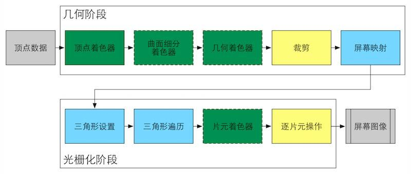
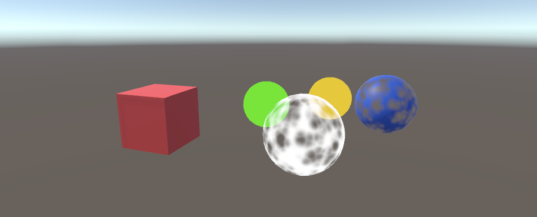
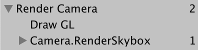
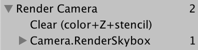

# 【Catlike Coding Custom SRP学习之旅】Custom Render Pipeline
#### 写在前面
我是一个计算机图形学领域的新手，虽然在游戏公司实习了有一段时间，但我对图形学的认知仍然十分肤浅，我目前看过Games 101，最近也把冯乐乐的《Shader入门精要》看完了，因此我的图形学知识只会小于等于这两者（忘了好多55），接下来我打算学习下SRP，参考其他大佬们的文章，并记录下自己的笔记，也算是给自己挖个坑吧（之前其实自己跟着Catlike做过前几章，但后来半途而废了），希望自己能填完这个坑。因为我的知识有限同时又喜欢无知地乱写，如果笔记中有错误，欢迎批评指正。


以下是原教程链接与我的Github工程：
[CatlikeCoding-SRP-Tutorial](https://catlikecoding.com/unity/tutorials/custom-srp/)
[我的Github工程](https://github.com/recaeee/CatlikeCoding-Custom-RP)

我使用的Unity版本为2021.3.11f1c2(教程中使用的为2019.2.6f1，希望之后不会给自己挖坑)，初始项目为Built-in的模板工程。废话了这么多，进入正题吧。


---

#### 自定义渲染管线 Custom Render Pipeline
在谈自定义渲染管线前，先唠唠**渲染管线**吧。

其实到现在为止，我仍然对渲染管线的概念模糊不清，在我的理解里，渲染管线是一个将一个数字几何世界呈现到屏幕上的抽象流程。而其对应的具体流程就是冯乐乐书中最开头讲的渲染流水线,即“计算机需要从一系列的顶点数据、纹理等信息出发，把这些信息最终转换成一张人眼可以看到的图像”。

而从接触图形学开始，我就对渲染管线的具体流程的理解十分粗暴，顶点数据首先进入顶点着色器进行MVP变换转换到摄像机空间，然后光栅化，每个片段进入片段着色器，设置每个片段的颜色，最后把像素呈现到屏幕上。（总感觉少了些很多东西呢）



在我的理解里，整个渲染的流程就如上图所示，通过openGL简单编写上述流程，最后我们很容易就能获得一幅无趣的图像。但在游戏中，我们需要实现光照、阴影等效果，而阴影贴图的渲染并不在上述这些阶段中（虽然说其实阴影贴图的渲染走的也是上面这一套流程，只是不是输出到屏幕图像上），那我们怎么样把阴影的实现加进去呢？而同时基于各种需求又会有前向渲染和延迟渲染，我们在哪一步生成阴影贴图，怎么样把各种效果，比如UI、透明物体叠加在原本无趣的图像上，渲染管线似乎就无法简单地像上述图片上所描述的那样了。

上述只是我对渲染管线的一定理解吧，其实参考[这个知乎问题的回答](https://www.zhihu.com/question/379346645/answer/1079363174)，可能会理解得更透彻一些，总结来说，上图中的”渲染管线”是指**GPU硬件层面的渲染管线**，而“自定义渲染管线”中的“渲染管线”是**应用层面的高级渲染管线，是需要通过api调用来搭建的管线**。

参考[丛越大佬对渲染管线的描述](https://zhuanlan.zhihu.com/p/70668533)，**渲染管线是游戏引擎完成一帧画面的高层渲染逻辑和流程**，而一些引擎中传统的前向和延迟渲染管线往往只开放了管线中一些顶点着色器、片元着色器的可编辑性，而这些局限的编辑肯定无法满足如今游戏开发者们对画面、性能的追求，比如NPR等风格化渲染，用那一套传统的管线去实现那些与众不同的效果就好比想尽办法拿两辆自行车拼一起组装成跑车，吃力也不一定能达到效果。换句话说，都什么年代了，都还在用传统管线。

我在网上也找到了一些对于为什么要选择使用自定义渲染管线而不是传统渲染管线的[讨论](https://www.zhihu.com/question/379857981)，总而言之，学习自定义渲染管线不仅能让自己更自由地去做开发，同时也能让自己对渲染管线的认识更进一步。

从Unity 2018开始，Unity就引入了自定义渲染管线，它实现了让我们在渲染流程中做任何事情，并且提供给了我们传统渲染管线中的那些工具，比如裁剪。这也就意味着像裁剪、设置相机属性、支持光源等传统渲染管线中必不可少的一些工作不需要我们自己编写，直接调用Unity封装好的函数就行了。这想想都让人兴奋吧，就好比我想自己创作一幅画，但基本所有我要用的画笔、工具、颜料都有人帮我准备好了，我只要管往画布上乱涂乱画就行了。在我的理解中，自定义渲染管线就是这样的一个东西：**我可以自定义渲染管线中的任何流程，并且已经给我准备好了基础的工具，不需要像编写OpenGL一样自己编写所有的操作**。

好了好了，你已经大致了解什么是渲染管线了，接下来就由你自己编写一套高质量渲染管线吧！:)（开始变成无情的翻译机器人）

（我只会对其中重要的部分进行翻译和解释，其他则会简单带过，否则量太多了）

---
#### 1.1 新建工程 Project Setup


进入项目第一步，进入PackageManager把除了*Unity UI*之外的Package全删了（保持项目中不存在没用到的Package和代码块是良好的习惯，当然我还保留了IDE的Package），然后把颜色空间从Gamma空间设置成线性空间（不要问我怎么设置，看原教程吧~）。

下一步，在场景中摆一些standard、unlit和transparent材质的物体。



#### 1.2 管线资源 Pipeline Asset

此时，Unity使用的Render Pipeline是默认的也就是Builtin的内置渲染管线，从Project Setting窗口中也可以看出。


因此，为了使用自定义渲染管线，我们要做的第一件是创建一个**自定义**的Render Pipeline Asset，*Render Pipeline Asset*是Unity已经定义好的一种Asset类型，既然要使用自定义的Asset，所以我们需要自己定义一个Asset类，让它继承自*RenderPipelineAsset*，这个自定义的类我们就叫它**CustomRenderPipelineAsset**，这里首先要明确的一点是，它是一个类型，我们要通过这个类型创建它的Asset实例来当作我们的Render Pipeline Asset。

现在一定会有人好奇这个Render Pipeline Asset是用来干啥的吧，其实Render Pipeline Asset的作用就是**定义**（注意，不是确定实际数值）了一些实际渲染时的参数，比如阴影质量、光照质量等。

那实际**确定**这些数值是多少的是谁呢？是**RenderPipeline**（这也就是为什么RenderPipelineAsset里会有一个函数叫CreatePipeline，同时这就意味着RenderPipeline的创建是基于RenderPipelineAsset的），RenderPipeline确定了实际游戏运行时我们的阴影质量是高是低这些。那为什么Unity要搞得这么复杂呢，我定义了一个Asset，结果这个Asset还只是定义了一些定义，然后最后应用的实例是RenderPipeline，哇这也太麻烦了。Unity这样做是有它的道理的，因为在实际游戏中，我们不可能只使用一套实际的参数，那就涉及到了我们会创建多个实际的RenderPipeline应用于不同质量的渲染上，其实很好理解吧，不同性能的设备上用的RenderPipeline肯定不同，不可能在一台低端机上跑很高质量的渲染，同时一台设备上，我可能也需要实时去切换渲染的质量。

写好RenderPipelineAsset的定义，CreatePipeline返回null之后，创建一个CustomRenderPipelineAsset,然后使用它，好，画面变黑啦~

```using UnityEngine;
using UnityEngine.Rendering;

[CreateAssetMenu(menuName = "Rendering/Custom Render Pipeline")]
public class CustomRenderPipelineAsset : RenderPipelineAsset
{
    //重写创建实际RenderPipeline的函数
    protected override RenderPipeline CreatePipeline()
    {
        //暂时返回null
        return null;
    }
}
```

#### 1.3 渲染管线实例 Render Pipeline Instance

在创建好CustomRenderPipelineAsset之后，因为我们在CreatePipeline函数中返回了null，因此当我们创建RenderPipeline的实例的时候会返回null，并没有实际的RenderPipeline产生，所以必然导致了我们的画面是全黑。所以，下一步，我们的目的是让CreatePipeline函数返回正确的RenderPipeline，那我们想返回的RenderPipeline必然是我们自定义的RenderPipeline，因此我们需要定义CustomRenderPipeline，它继承自RenderPipeline，同时我们必须重写其中的Render函数。

```
using UnityEngine;
using UnityEngine.Rendering;

public class CustomRenderPipeline : RenderPipeline
{
    //必须重写Render函数，目前函数内部什么都不执行
    protected override void Render(ScriptableRenderContext context, Camera[] cameras)
    {
        
    }
}
```

(CustomRenderPipelineAsset那边的修改就不贴上来了，在这里只贴上我认为关键的部分)

#### 2 渲染 Rendering

在RenderPipeline的实例中，Unity每一帧都会执行其Render函数，该函数传入了一个ScriptableRenderContext类型的context用于连接引擎底层，我们用它来实际进行渲染，粗暴来说，每帧内所有渲染相关的信息都存放在context中，同时该函数传入一个摄像机数组，很好理解，意思是我们要在当前帧按顺序渲染这些摄像机拍到的画面。

#### 2.1 摄像机渲染器 Camera Renderer

我们希望每一个摄像机都会以各自的方式去渲染。所以我们不会使用CustomRenderPipeline渲染所有的摄像机，而是定义一个CameraRenderer类用于管理所有摄像机的渲染。

```
using UnityEngine;
using UnityEngine.Rendering;

public class CameraRenderer
{
    //存放当前渲染上下文
    private ScriptableRenderContext context;

    //存放摄像机渲染器当前应该渲染的摄像机
    private Camera camera;

    //摄像机渲染器的渲染函数，在当前渲染上下文的基础上渲染当前摄像机
    public void Render(ScriptableRenderContext context, Camera camera)
    {
        this.context = context;
        this.camera = camera;
    }
}
```

虽然前面说了希望每个摄像机以各自的方式渲染，但目前看来我们所有摄像机都是以相同的方式渲染(调用CameraRenderer.Render函数)，但是你先别急。

#### 2.2 绘制天空盒 Drawing the Skybox

虽然这一步的标题是“绘制天空盒”，但我们更需要注意的一点是，我们渲染的流程是**将一系列渲染相关的指令缓存到上下文中，再进行提交，以此按顺序执行缓存的指令队列**。

```
using UnityEngine;
using UnityEngine.Rendering;

public class CameraRenderer
{
    //存放当前渲染上下文
    private ScriptableRenderContext context;

    //存放摄像机渲染器当前应该渲染的摄像机
    private Camera camera;

    //摄像机渲染器的渲染函数，在当前渲染上下文的基础上渲染当前摄像机
    public void Render(ScriptableRenderContext context, Camera camera)
    {
        //设定当前上下文和摄像机
        this.context = context;
        this.camera = camera;
        
        DrawVisibleGeometry();
        Submit();
    }
    
    void DrawVisibleGeometry()
    {
        //添加“绘制天空盒”指令，DrawSkybox为ScriptableRenderContext下已有函数，这里就体现了为什么说Unity已经帮我们封装好了很多我们要用到的函数，SPR的画笔~
        context.DrawSkybox(camera);
    }

    void Submit()
    {
        //提交当前上下文中缓存的指令队列，执行指令队列
        context.Submit();
    }
}
```

完成了这步，Scene和Game视窗内出现了天空盒，从FrameDebugger中也可以抓帧看到执行了一条Camera.RenderSkybox，其内部进行了一次Draw Mesh，也就是天空盒的Mesh。（FrameDebugger是个很不错的工具，要多多使用~）

另外值得注意的一点是，目前我们并没有根据摄像机的信息（位置、朝向）去渲染天空盒，因此当摄像机转动时，渲染的天空盒是不会因此发生变化的。因此我们需要提供摄像机的View Matrix（世界空间->观察空间）与Projection Matrix（观察空间->裁剪空间），在Shader中这两者合并为unity_MatrixVP提供给vertex和fragment着色器使用。

[抓帧图片]

此时，无论改变scene camera还是main camera，抓帧显示的unity_MatrixVP都不会发生变化，当前应该是默认值，我挺好奇默认值为啥这么怪。

好了，到了这一节的第三个终点，我们要在绘制天空盒前把摄像机的信息告诉上下文，实现方法如下。

```
    public void Render(ScriptableRenderContext context, Camera camera)
    {
        //设定当前上下文和摄像机
        this.context = context;
        this.camera = camera;
        
        Setup();
        DrawVisibleGeometry();
        Submit();
    }

    void Setup()
    {
        //把当前摄像机的信息告诉上下文，这样shader中就可以获取到当前帧下摄像机的信息，比如VP矩阵等
        context.SetupCameraProperties(camera);
    }
```

此时，我们转动scene窗口摄像机，天空盒会被正确地绘制了，当改变main camera的transform时，抓帧可以看到unity_MatrixVP矩阵发生了变化。（从这一点也可以看出，即使不在Runtime下，FrameDebugger抓帧抓的也是Game视窗下的）

#### 2.3 渲染指令缓冲 Command Buffers

在2.2中，很重要的一点是**我们将一系列渲染指令添加到上下文的渲染指令缓冲中，然后通过Submit提交指令队列，以此按顺序执行所有指令**。像DrawSkybox这样的指令，它直接被定义在了context中（可以通过context.DrawSkybox执行），但有其他的指令必须通过Command buffer的实例去执行。

因此我们首先在Camera Renderer中创建一个Command Buffer的实例对象，并且通过buffer.Begin/EndSample让Profiler和Frame Debugger对其进行监测。

```
void Setup()
    {
        //在Profiler和Frame Debugger中开启对Command buffer的监测
        buffer.BeginSample(bufferName);
        //提交CommandBuffer并且清空它，在Setup中做这一步的作用应该是确保在后续给CommandBuffer添加指令之前，其内容是空的。
        ExecuteBuffer();
        //把当前摄像机的信息告诉上下文，这样shader中就可以获取到当前帧下摄像机的信息，比如VP矩阵等
        context.SetupCameraProperties(camera);
    }
    void DrawVisibleGeometry()
    {
        //添加“绘制天空盒”指令，DrawSkybox为ScriptableRenderContext下已有函数，这里就体现了为什么说Unity已经帮我们封装好了很多我们要用到的函数，SPR的画笔~
        context.DrawSkybox(camera);
    }

    void Submit()
    {
        //在Proiler和Frame Debugger中结束对Command buffer的监测
        buffer.EndSample(bufferName);
        //提交CommandBuffer并且清空它
        ExecuteBuffer();
        //提交当前上下文中缓存的指令队列，执行指令队列
        context.Submit();
    }

    void ExecuteBuffer()
    {
        //我们默认在CommandBuffer执行之后要立刻清空它，如果我们想要重用CommandBuffer，需要针对它再单独操作（不使用ExecuteBuffer），舒服的方法给常用的操作~
        context.ExecuteCommandBuffer(buffer);
        buffer.Clear();
    }
```

显然，此时我们CommandBuffer里并没有添加任何操作，因此执行CommandBuffer时其实什么都没做，但通过FrameDebugger可以看到Render Camera这个标签下把RenderSkybox包括进去了。这是不是很奇怪？因为Render Camera这个标签我们是想用来监测CommandBuffer的（毕竟我们执行的是buffer.BeginSample)。因此我在这里做大胆猜想，buffer.BeginSample的内部其实调用的就是Profiler.BeginSample，而Profiler.BeginSample和EndSample是用于监测一个时间段内的操作，因此由于在buffer的Sample过程中，我们执行了DrawSkybox，导致了DrawSkybox被包括在了Render Camera这一标签下。

而这个猜想很快得到了验证，在我将buffer.BeginSample放在DrawSkybox之后执行时，FrameDebugger中DrawSkybox不再包括在Render Camera标签下。（但具体是不是直接调用的Profiler.BeginSample有待考证）


#### 2.4 清除渲染目标 Clearing the Render Target

Render Target指的是摄像机应该渲染到的地方，这个地方要么是Frame Buffer（也就是最终会输出到屏幕上的buffer），要么是Render Texture（我们自己创建的渲染纹理，这张纹理可以用来做任何事，当然也可以当frame buffer用）。

在一帧内，摄像机在开始渲染前通常会清空其Render Target，包括了Color（颜色）、Depth（深度）和Stencil（模板），以确保前一帧的内容不会影响到当前帧内容。

这一节需要注意的一点是，在SetupCameraProperties之前进行ClearRenderTarget不如在其之后进行，从结果上来说，前者实现清理是通过渲染一个full-screen quad来达到的，而后者是直接清理其颜色、深度缓冲达到的，因此前者（进行一次渲染Draw GL）效率不如后者（直接操作缓存）。但其原因是什么不得而知，我猜想这是因为ClearRenderTarget执行中会先判断当前上下文是否设置了当前的Render Target，如果未设置，则放置一个full-screen quad到场景中，一旦之后SetupCameraProperties时，立刻渲染一次；而先设置就很好理解，已知Render Target，就知道缓冲的地址，直接清除缓冲就行。



<center>先SetupCameraProperties再ClearRenderTarget</center>


<center>先ClearRenderTarget再SetupCameraProperties</center>


## 参考
1. https://catlikecoding.com/unity/tutorials/custom-srp/custom-render-pipeline/
2. 冯乐乐《Shader入门精要》
3. https://zhuanlan.zhihu.com/p/366139386
4. https://zhuanlan.zhihu.com/p/70668533
5. https://www.zhihu.com/question/379857981
6. https://www.zhihu.com/question/379346645/answer/1079363174